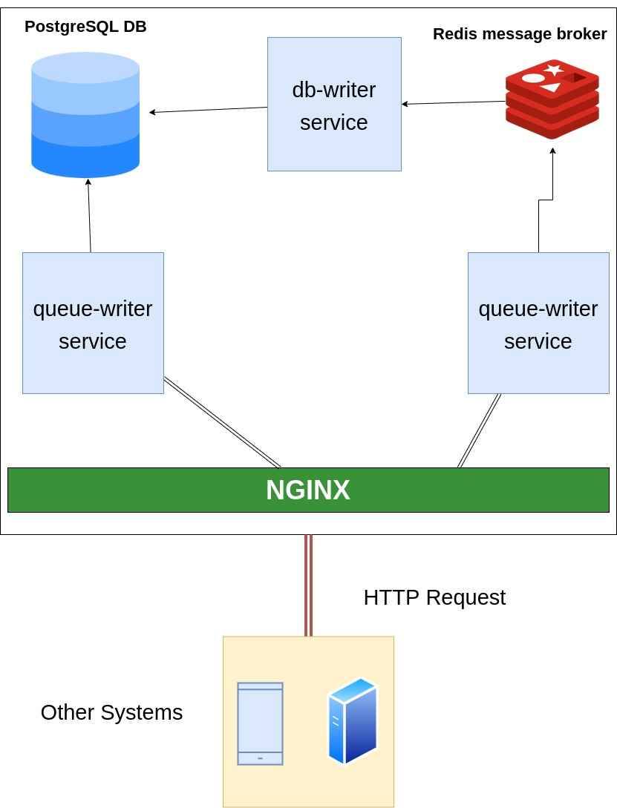

# Audit Log

The service accepts event data sent by other systems and provides an HTTP endpoint for querying recorded event data by field values.

## Archtecture

<div style="flex;justify-content:center;width:100%">

</div>
## TODO

- build the authentication service.
- build an email service to notify the maintainer if anything got wrong.
- increase the number of writers to DB services.
- replace Redis streams with Kafka.
- depending on the consumers, re-shaping the schema of the logs

## Installation

Requirements

- Docker.
- Make
- cURL

first, go to the project folder
then run makeup to start all containers the without forcing a build

```bash
    cd ./project
```

then run make build_queue-writer to build the queue-writer service

```bash
   make build_queue-writer
```

then run make build_db-writer to build the db-writer service

```bash
   make_build_db-writer
```

then run makeup to start all containers in without forcing a build

```bash
    make up
```

## Usage

now the project is ready to accept requests

here is the shape of the log request body.

```go
    type Log struct{
        event_name:string // required
        description: string // required
        created_at: time.Time // not-required
        customer_id : int64 // not required
    }
```

### Writing

example 1

```bash
    BODY='{"event_name":"new customer","description":"account was created for a given identity", "customer_id":18}'
    curl -d "$BODY" localhost:3050/api/write

{
  "log": {
    "created_at": "2022-11-14T21:32:26.49855523Z",
    "event_name": "new customer",
    "description": "account was created for a given identity",
    "customer_id": 18
  }
}
```

### Reading

to read data from the service, you can tweak the query to get your desired results

- Filtering, filter by event_name or customer_id, i.g. ?event_name=new or ?customer_id=18 or combine both with & between then like ?event_name=new&customer_id=18.

- Sorting, sort ASC OR DESC, you can sort depending on (event_name, and created_at)
  to sort ASC --> ?sort=event_name or ?sort=created_at
  to sort DESC --> ?sort=-event_name or ?sort=-created_at

- Paginating, skip and limit logs as you want, for example, if i wanted to skip page 1 and select the next 10 logs, "hence here it the page size will be 10"
  you can append --> ?page_size=10&page=2

  example 2

```bash
    curl http://localhost:3050/api/read?sort=created_at&event_name=user

    {
	"logs": [
		{
			"id": 1,
			"created_at": "2022-11-14T21:01:56Z",
			"event_name": "user_signed_in",
			"description": "a new user has code"
		}
	],
	"metadata": {
		"current_page": 1,
		"page_size": 20,
		"first_page": 1,
		"last_page": 1,
		"total_records": 1
	}
}
```

example 3

```bash
    curl http://localhost:3050/api/read?sort=-event_name&page_size=1&page=2

{
	"logs": [
		{
			"id": 2,
			"created_at": "2022-11-14T21:32:26Z",
			"event_name": "new customer",
			"description": "account was created for a given identity",
			"customer_id": 18
		}
	],
	"metadata": {
		"current_page": 2,
		"page_size": 1,
		"first_page": 1,
		"last_page": 2,
		"total_records": 2
	}
}
```

**_Hence all api tested against all invalid queries and it will return an error if their undesirable value provided_**

example 4

```bash
    curl http://localhost:3050/api/read?sort=time

    {
	"error": {
		"sort": "invalid sort value"
	}
}
```

##

to stop docker-compose (if running), builds all projects and start docker compose
run :

```bash
    make up_build
```
